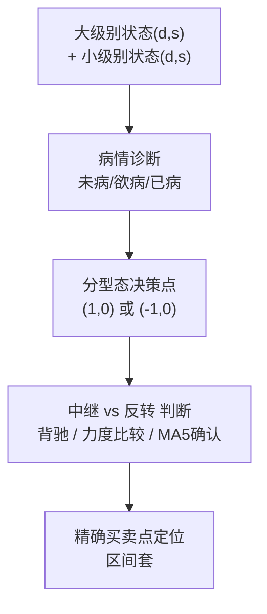
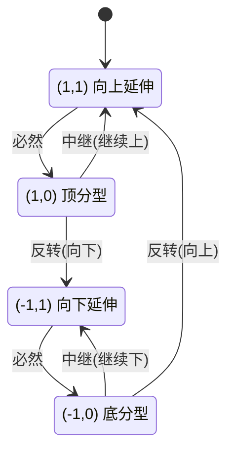
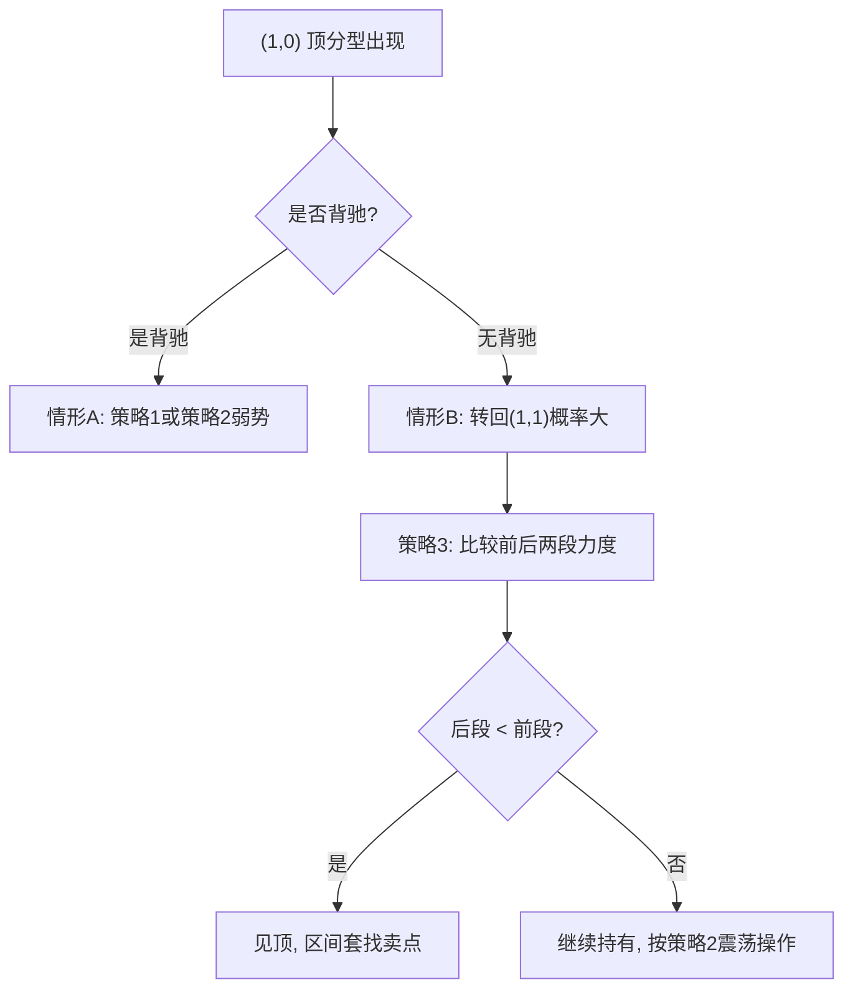
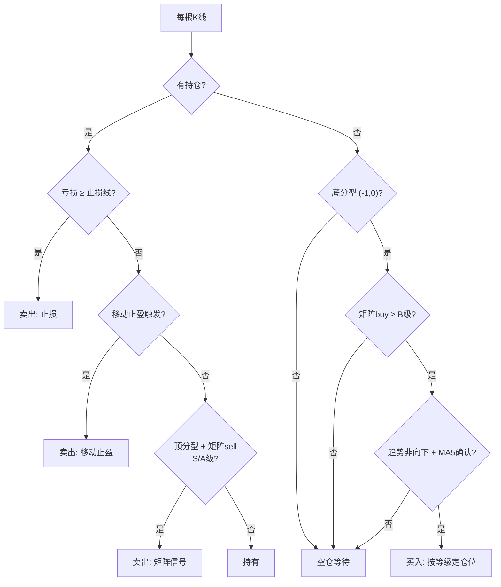

# 缠论两重表里关系：从原理到买卖策略实现

> **来源**：《教你炒股票》第 91-92 课（2007-12-17 / 2008-01-15）
> **用途**：将"走势结构的两重表里关系"从理论原理推导至可直接编码的买卖策略规则集。
>   本文档是 `bi_state.py` / `bi_state_strategy_v2.py` 的算法规范。
> **前置阅读**：`chanlun_knowledge_base.md`（基础概念词典）

---

## 目录

1. [理论基础：为什么是"笔"？](#一理论基础为什么是笔)
2. [核心公式：买卖逻辑链](#二核心公式买卖逻辑链)
3. [笔状态四态机](#三笔状态四态机)
4. [多级别联立诊断：病情矩阵与盈利转折预测](#四多级别联立诊断病情矩阵与盈利转折预测)
5. [买卖决策完全分类（第92课三策略）](#五买卖决策完全分类第92课三策略)
6. [精确买卖点定位（区间套）](#六精确买卖点定位区间套)
7. [交易参数与执行规则](#七交易参数与执行规则)
8. [策略参数速查](#八策略参数速查)
9. [编码实现清单](#九编码实现清单)
10. [附录：常见误区](#附录常见误区)

---

## 一、理论基础：为什么是"笔"？

### 1.1 表里关系的本质

原文借用中医"肺和大肠相表里"的比喻，揭示走势分解配件的两大类型：

> 在走势分解的配件中，有两种类型：
> （1）**能构成中枢的** —— 线段及各级别走势类型；
> （2）**不能构成中枢的** —— 只有笔。
> 笔是不能构成中枢的，这就是笔和线段以及线段以上各种级别走势类型的最大区别。
> 因此在不同时间周期 K 线图上的相应判断，笔就构成了一个**表里相关**的判断。

**关键洞察**：之所以选择"笔"而非"线段"作为多级别联立的桥梁，正是因为**笔不能构成中枢**。
线段以上的走势类型，本身就是由中枢定义的，在不同级别上"表里"关系会被中枢逻辑混淆；
而笔是最小、最纯净的走势单元，跨级别的笔状态对比，能最清晰地反映"表里"关系。

### 1.2 缠中说禅笔定理

> 任何的当下，在任何时间周期的 K 线图中，走势必然落在一确定的具有明确方向的笔当中
> （向上笔或向下笔）。在笔当中的位置，必然只有两种情况：
> （1）在分型构造中；
> （2）在分型构造确认后延伸为笔的过程中。

这条定理保证：**任何级别、任何时刻，走势都可用确定的状态描述**——这是状态机可计算的基础。

### 1.3 核心结论

> 大级别的改变**一定是先从小级别开始的**，而小级别变化一旦打破大级别的均衡，
> 就意味着大级别的变化到来。

这就是多级别联动操作的依据，也是"未病→欲病→已病"预警的理论根基。

---

## 二、核心公式：买卖逻辑链

两重表里关系构成买卖的完整逻辑链条：



**一句话概括**：
- **大级别**告诉你"该不该动"（方向判断）
- **小级别**告诉你"何时动"（时机选择）
- **$(1,0)$ / $(-1,0)$** 是唯一的决策岔路口
- **背驰 + 区间套** 在岔路口精确定位买卖点

---

## 三、笔状态四态机

### 3.1 四态定义

用两个变量构成的数组 $(d, s)$ 精确定义当下走势。任何当下只有这四种状态，
**这四种状态描述了所有的当下走势**。

| 状态枚举 | 数组 $(d,s)$ | 方向 $d$ | 阶段 $s$ | 含义 | 操作属性 |
|---------|-------------|---------|---------|------|---------|
| `UP_EXTENDING` | $(1,1)$ | 向上 | 延伸 | 向上笔延伸中 | 持有/观望 |
| `UP_FX_FORMING` | $(1,0)$ | 向上 | 分型 | 顶分型构造中 | **卖决策点** |
| `DOWN_EXTENDING` | $(-1,1)$ | 向下 | 延伸 | 向下笔延伸中 | 空仓/观望 |
| `DOWN_FX_FORMING` | $(-1,0)$ | 向下 | 分型 | 底分型构造中 | **买决策点** |

> **关键结论**：买卖点全部集中在 $(1,0)$ 和 $(-1,0)$ 之后——因为只有分型构造态才有
> 两种后续可能（中继 or 反转），其余状态走势是确定的。延伸态是单向的，没有决策价值。

### 3.2 合法转移规则（不能随便连接）

```
(1, 1)  ──必然──>  (1, 0)               向上延伸 → 必先出现顶分型
(-1, 1) ──必然──>  (-1, 0)              向下延伸 → 必先出现底分型
(1, 0)  ──分叉──>  (1, 1) 或 (-1, 1)    顶分型后：中继(继续上) or 反转(向下)
(-1, 0) ──分叉──>  (-1, 1) 或 (1, 1)    底分型后：中继(继续下) or 反转(向上)
```

**非法转移（原文明确禁止）**：
- $(1,1)$ 之后**绝对不会**连接 $(-1,1)$ 或 $(-1,0)$
- $(-1,1)$ 之后**绝对不会**连接 $(1,1)$ 或 $(1,0)$

> **可变的状态是极为有限的**，从中可以分析出可能变化状态中出现最大可能盈利的转折状态，
> 这种转折是必然的。



> 实现要点：维护状态序列，每次转移需校验合法性，非法转移视为数据/识别错误。

---

## 四、多级别联立诊断：病情矩阵与盈利转折预测

> **原文核心**：「每一种状态并不能随机转化到任何的另一种状态，可变的状态是极为有限的，
> 从中可以分析出可能变化状态中出现最大可能盈利的转折状态，这种转折是必然的。」
>
> 这里先不追求复杂的力度判断和止损止盈，而是把病情矩阵的首要任务定义为：
> **先统计概率**。也就是说，先把每个状态组合在历史上出现后，是否真的形成向上的笔或向下的笔，
> 统计清楚，再决定是否交易。为此，先聚焦两种**交易策略**：**30分钟策略**与**日线策略**
> （即在 30分钟 / 日线 K 线的向上笔开始买入、结束卖出）。病情矩阵统计的 K 线类型（多级别状态组合）不变。

### 4.1 过滤规则（避免噪音）

考察两个相邻级别（如周线=大级别，日线=小级别）：

> 如果大级别处于 $(1,1)$ 或 $(-1,1)$（笔延伸中），则小级别的一切波动
> **没有太大价值**，因为不足以改变大级别的延伸状态。

```
if 大级别.is_extending:
    忽略小级别波动，仅持有/观望
```

### 4.2 上涨行情：未病→欲病→已病预警

以大级别 $(1,1)$（向上笔延伸）为例，观察小级别演化：

| 小级别状态 | 含义 | 大级别病情判断 |
|-----------|------|--------------|
| $(1,1)$ | 小级别也向上延伸 | **健康**，大级别 $(1,1)$ 断无可能在短时间内改变 |
| $(1,0)$ 出现 | 小级别出现顶分型 | **未病**（小警告）；若只出现 1 根 K 线则不足以破坏大级别结构 |
| $(1,0)$ 被确认 + 转向 $(-1,1)$ | 小级别向下笔确认 | **欲病**（向已病发展的前兆）；大级别 $(1,0)$ 开始形成中 |
| 大级别 $(1,0)$ 确认→$(-1,1)$ | 大级别顶分型确认 + 向下笔 | **已病**（调整确认，该卖了） |

### 4.3 下跌行情：恶劣程度排序（买点参考）

以 2007-12-17 大盘为例，周线/日线组合的恶劣程度排序：

| 排名 | 大级别（周线） | 小级别（日线） | 病情 | 操作建议 |
|------|--------------|--------------|------|---------|
| 第1恶劣 | $(-1,1)$ | $(-1,1)$ | 已病 | 同向下跌最差，**空仓，绝对不买** |
| 第2恶劣 | $(-1,1)$ | $(-1,0)$ | 已病 | 小级别底分型，**观察不急买** |
| 第3恶劣 | $(-1,0)$ | $(-1,1)$ | 欲病 | 大级别底分型构造中，**准备进场** |
| **转机** | $(-1,0)$ | $(-1,0)$ | 未病 | **双底分型，一买信号区** |

> 对称地，上涨行情的卖点把上述方向全部取反即可。

### 4.4 病情矩阵（可扩展到全级别）

原文给出一个 **8 行矩阵**（1分钟/5分钟/30分钟/日/周/月/季/年），每行是对应级别的状态数组：

> 用巨大的计算机，我们可以实时监控所有股票的病情。注意，每一种状态并不能随机转化
> 到任何的另一种状态，可变的状态是极为有限的，从中可以分析出可能变化状态中出现最大
> 可能盈利的转折状态，这种转折是必然的。

| 级别 | 方向 $d$ | 阶段 $s$ | 组合 |
|------|---------|---------|------|
| 1分钟 | ... | ... | ... |
| 5分钟 | ... | ... | ... |
| 30分钟 | ... | ... | ... |
| 日线 | ... | ... | ... |
| 周线 | ... | ... | ... |
| 月线 | ... | ... | ... |
| 季线 | ... | ... | ... |
| 年线 | ... | ... | ... |

理论上可监控所有股票的"病情"，找出最大可能盈利的转折状态。

### 4.5 状态空间分析：可变状态极为有限

状态转移的有限性是概率预测的基础——**正因为状态不能随机转化，走势才是可预测的**。

**单级别的有限性**：
- 只有 4 个状态，每个状态的后继最多 2 种
- 延伸态（$s=1$）→ 只有 1 个后继（必然转入分型态），**无需预测**
- 分型态（$s=0$）→ 只有 2 个后继（中继 or 反转），**这才是唯一需要预测的岔路**

> 延伸态占了一半状态，但它们是单向确定的，没有预测价值。真正的博弈点只有分型态——
> 四态中真正需要「猜」的只有两个态，每个态只有两种可能。**这就是「可变状态极为有限」的精确含义。**

**双级别联立的组合空间**：4×4 = 16 种状态组合，但按操作价值可分为四类：

| 大级别＼小级别 | $(1,1)$ 向上延伸 | $(1,0)$ 顶分型 | $(-1,1)$ 向下延伸 | $(-1,0)$ 底分型 |
|---------------|-----------------|---------------|------------------|---------------|
| **$(1,1)$** | 健康持有 | 未病预警 | 🔇噪音，忽略 | 🔇噪音，忽略 |
| **$(1,0)$** | 卖点观察区 | ⭐**共振卖点** | 欲病→已病 | ⚠方向矛盾 |
| **$(-1,1)$** | 🔇噪音，忽略 | 🔇噪音，忽略 | 最恶劣，空仓 | 次恶劣，观察 |
| **$(-1,0)$** | ⚠方向矛盾 | ⭐**共振买点** | 欲病转机 | 买点确认区 |

> 16 种组合中，真正值得**主动交易**的只有 **6 种**（⭐共振 2 种 + 观察区 4 种），
> 其余 10 种要么是确定性延伸（持有/空仓），要么是噪音（忽略）。
> 这就是「可变的状态极为有限」在操作层面的含义：**大部分时间应该等待，只在少数高价值组合出现时行动**。

### 4.6 最大可能盈利的转折状态：先统计概率

从有限的交易组合中，如何进一步筛选「最大可能盈利」？先不要急着谈复杂赔率，先把**胜率**做扎实。

#### 交易目标：先定义“胜负”

胜负的定义取决于**交易策略**，而交易策略由"在哪一级 K 线上买卖向上笔"决定。
先聚焦两种交易策略：

| 交易策略 | 买入点 | 卖出点 | 胜负判定 |
|---------|--------|--------|---------|
| **30分钟策略** | 30分钟 K 线向上笔开始 | 30分钟 K 线向上笔结束 | 买入后，30分钟 K 线出现向上笔 → 胜；出现向下笔 → 败 |
| **日线策略** | 日线 K 线向上笔开始 | 日线 K 线向上笔结束 | 买入后，日线 K 线出现向上笔 → 胜；出现向下笔 → 败 |

> **关键澄清**：这两种策略是**独立的交易执行方式**。
> 病情矩阵统计的 K 线类型（多级别状态组合）不变——无论用哪种策略，
> 都是用同一套病情矩阵的状态组合来判断"是否该进"。
> 区别只在于：买入后，我们用哪个级别的 K 线来确认"向上笔"是否出现。
>
> 也就是说，同一个病情矩阵，可以分别服务两种策略：
> - 看 30分钟 K 线是否形成向上笔 → 得到"30分钟策略"的胜率
> - 看 日线 K 线是否形成向上笔 → 得到"日线策略"的胜率

这样就把交易结果从复杂的盈亏，简化为一个清晰的二分类问题：

$$
\text{买入胜率} = \frac{\text{底分型后该策略级别出现向上笔的次数}}{\text{底分型总次数}}
$$

$$
\text{卖出胜率} = \frac{\text{顶分型后该策略级别出现向下笔的次数}}{\text{顶分型总次数}}
$$

#### 买卖信号对称设计

病情矩阵对**买入信号**和**卖出信号**做对称统计：

| 信号类型 | 触发状态 | 胜利条件（win） | 失败条件（loss） |
|---------|----------|----------------|-----------------|
| **买入** | $(-1,0)$ 底分型 | 后续出现 $(1,1)$ 向上笔延伸 | 后续出现 $(-1,1)$ 向下笔延伸 |
| **卖出** | $(1,0)$ 顶分型 | 后续出现 $(-1,1)$ 向下笔延伸 | 后续出现 $(1,1)$ 向上笔延伸 |

> 底分型后是否真的向上反转？顶分型后是否真的向下反转？
> 两者分开统计，买卖白名单也分别筛选——同一个状态组合，可能在买入白名单中但不在卖出白名单中。

#### 病情矩阵的统计维度

病情矩阵统计的**状态组合**（即 K 线类型）不变，仍然是多级别联立的状态。
先只统计以下关键维度：

1. **交易策略**：30分钟策略 / 日线策略（决定胜负如何判定，不改变状态组合的统计）
2. **当前状态组合**：大级别状态 + 小级别状态（病情矩阵本身统计的 K 线类型）
3. **交易方向**：买入（底分型）/ 卖出（顶分型）——买卖信号分开统计
4. **结果标签**：向上笔 / 向下笔（按所选策略的级别判定）
5. **分型出现次数**：在本级别 K 线笔类型出现反转之前，当前级别已经出现过多少次 $(1,0)$ 或 $(-1,0)$

这第五个维度是你特别要求的重点：

> 在本级别 K 线笔类型出现反转之前，级别中出现 $(1,0)$ 或 $(-1,0)$ 的次数，
> 不是简单的“有无”，而是会影响反转概率。
> 也就是说，同样是 $(-1,0)$，出现 1 次、2 次、3 次……后续反转的概率并不一样；
> 所以“出现次数”本身就是一个不可忽略的统计维度，需要按次数分桶统计。

#### 反转概率表：先按次数统计

我们可以把病情矩阵扩展成下面这种结构，买入和卖出信号对称统计：

| 交易方向 | 交易策略 | 当前状态 | 分型出现次数 | 胜利结果 | 统计样本 |
|---------|---------|----------|--------------|----------|----------|
| 买入 | 30分钟策略 | 大$(-1,0)$ + 小$(-1,0)$ | 1 | 向上笔 | 统计数 |
| 买入 | 30分钟策略 | 大$(-1,0)$ + 小$(-1,0)$ | 2 | 向上笔 | 统计数 |
| 买入 | 30分钟策略 | 大$(-1,0)$ + 小$(-1,0)$ | 3 | 向上笔 | 统计数 |
| 卖出 | 30分钟策略 | 大$(1,0)$ + 小$(1,0)$ | 1 | 向下笔 | 统计数 |
| 卖出 | 30分钟策略 | 大$(1,0)$ + 小$(1,0)$ | 2 | 向下笔 | 统计数 |
| 卖出 | 30分钟策略 | 大$(1,0)$ + 小$(1,0)$ | 3 | 向下笔 | 统计数 |

这样得到的不是“一个状态一个结论”，而是“同一个状态在不同出现次数下的不同概率”。
这正是病情矩阵真正有价值的地方：

> 同样是底分型，不同的出现次数，后续方向的概率可能完全不同。
> 出现次数不是用来指定某个具体次数的，而是作为一个连续/分桶的统计维度：
> 到底多少次时反转概率最高，应该由历史数据本身说了算。
> 这就是病情矩阵从“诊断工具”升级为“概率引擎”的关键。

#### 先做概率，而不是先做赔率

因为你要求的是先聚焦概率，所以在初期迭代中，以下规则优先级最高：

1. **先统计胜率**：只要买入后来出现向上笔的概率足够高，就值得做
2. **先聚焦 30分钟/日线**：先不扩散到太多级别
3. **先按“分型出现次数”分桶**：以出现次数为统计维度，分桶统计，不预设哪个次数一定更好
4. **先做“高概率白名单”**：把历史上胜率最高的状态组合记入白名单，优先交易

#### 4.7 实操框架：先让病情矩阵变成“高概率白名单”

把病情矩阵的目标从“判断病情”收敛到“筛出高概率转折状态”：

| 目标 | 方法 |
|------|------|
| 先建立 30分钟策略/日线策略 的概率表 | 统计每个状态组合在不同出现次数下的胜率（按策略分别统计） |
| 再筛选高概率交易点 | 取历史胜率最高的组合作为白名单 |
| 最后再执行交易 | 只在白名单中的组合上交易 |

> 这一步的核心不是“看起来像转折”，而是“历史上真的经常转折”。
> 所以病情矩阵先做概率，而不是先做复杂的趋势/力度判断。

### 4.7 实操框架：先让病情矩阵变成“高概率白名单”

#### 先做胜率，不做复杂判断

1. **只在分型态交易**：延伸态是单向确定的，没有预测价值；分型态才是二选一的岔路
2. **先聚焦 30分钟策略 / 日线策略**：先从这两种交易策略开始做概率统计，避免把注意力分散
3. **把“分型出现次数”作为关键变量**：同样出现 $(1,0)$ / $(-1,0)$，出现次数不同，胜率可能不同
4. **只在高胜率白名单上交易**：把历史上胜率最高的组合挑出来，按白名单执行

#### 交易信号分级

将上述原则综合，形成可量化的信号分级：

| 信号等级 | 统计条件 | 建议仓位 |
|---------|----------|----------|
| **S级** | 交易策略为 30分钟策略/日线策略，且状态组合在高胜率白名单中，且分型出现次数达到历史高概率区间 | 重仓 |
| **A级** | 状态组合命中高胜率白名单，但样本较少或次数区间不够稳定 | 中仓 |
| **B级** | 组合有一定胜率，但不够稳定，仅作轻仓观察 | 轻仓 |
| **C级** | 组合未进入白名单，或样本不足 | 观望 |

> **S级信号** = 最高概率转折状态。先把交易资源集中在 S/A 级，而不是频繁交易 B/C 级。

---

## 五、买卖决策完全分类（第92课三策略）

> §4.7 的信号分级回答了「何时进场」，本节的三策略回答「进场后如何管理持仓」。
> 两者配合：用病情矩阵找到最大盈利转折点进场，用三策略管理退出。

所有问题都集中在 $(1,0)$ 或 $(-1,0)$ 之后如何演化。原文给出**三套策略**，
对应不同操作水平。以 $(1,0)$ 顶分型为例（卖点），买点对称处理 $(-1,0)$。

### 策略1：保守型 —— 兑现成本，留利润

**触发条件**：$(1,0)$ 出现且已有足够获利空间

**操作**：
1. 把成本先兑现出来，留下零成本筹码，让市场自己选方向
2. 剩余筹码处理：
   - 若后续选 $(-1,1)$：看低周期图（日线/30分钟），向下笔结束后回抽向上笔
     **不创新高**就卖；或直接看 **5 周均线**，有效跌破就卖
3. 若选 $(1,1)$：继续持有

**适用**：稳健投资者，不想做短差

### 策略2：震荡型 —— 先卖后买做短差

**触发条件**：$(1,0)$ 出现，预计会有震荡

**操作**：
1. 围绕 $(1,0)$ 后的震荡，操作都是**先卖后买**
2. 分析 $(1,1)→(1,0)$ 对应的小级别走势类型（大级别 $(1,0)$ 必然对应某小级别上涨）：
   - **情形A（有背驰）**：震荡区间以上涨最后一个中枢为依据
     - 强势震荡：围绕该区间做短差
     - 弱势震荡：走势要变 $(-1,1)$，最好不参与，等大级别 $(-1,0)$
   - **情形B（无背驰）**：$(1,0)$ 转回 $(1,1)$ 的可能性很大 → 不急于卖
3. 一旦确认市场选了 $(-1,1)$：最后一次低位**不回补，完全退出**

**适用**：有时间盯盘、擅长震荡操作的投资者

### 策略3：力度比较型 —— 判断中继是否见顶

**触发条件**：市场最终选择 $(1,1)$（中继继续上）

**操作**：
1. 比较 $(1,0)$ 区间上下两段 $(1,1)$ 的力度（MACD 柱子面积/黄白线高度）
2. 后段力度 < 前段 → **明确见顶信号** → 用区间套定位精确卖点
3. 力度未衰减 → 继续持有，按策略2操作

**适用**：精通力度比较的高级投资者

### 5.1 三策略的选择流程



### 5.2 关键辅助判断

- **5 周期均线**：$(1,0)$ 后有效跌破 5 周期均线 → 形成笔的概率大增
- **分型出现次数**：同样的分型态，出现次数不同，后续反转概率可能不同

---

## 六、精确买卖点定位（区间套）

两重表里关系给出**方向性判断**，精确买卖点靠**区间套递归定位**：

```
大级别背驰段 → 次级别背驰段 → 次次级别背驰段 → ... → 精确买卖点
```

### 6.1 三类买卖点的定位规则

| 类型 | 定位规则 | 在两重表里中的对应 |
|------|---------|------------------|
| **一买** | 下跌趋势背驰后，最后中枢下方最低点 | 大级别 $(-1,0)$ + 背驰确认 |
| **二买** | 一买后次级别回抽不创新低 | 小级别 $(-1,0)→(1,1)$ 中继 |
| **三买** | 次级别离开中枢后回抽不破 ZG | 小级别突破后回踩不破中枢上沿 |

> 卖点对称：一卖（上涨背驰）、二卖（反弹不创新高）、三卖（回抽不破 ZD）。
> **二买 + 三买重合 = 最强信号**。

---

## 七、买卖条件与止损规则

> 基于病情矩阵的买卖信号分级（§4.7）和原文三策略（§5），设计完整的进场/出场/止损体系。

### 7.1 买入条件（全部 AND，缺一不可）

持仓为空时，每根 K 线检查以下全部条件，**全部满足才买入**：

| 条件 | 判定 | 参数 |
|------|------|------|
| **1. 底分型** | 当前笔状态 = $(-1,0)$ | `BiState.DOWN_FX_FORMING` |
| **2. 概率矩阵确认** | 方向="buy"，等级 ≥ B（胜率 ≥ 42%） | `grade_for(..., "buy")` |
| **3. 趋势非向下** | MA60 方向 ≠ down（允许 up / sideways） | `ma_trend=60` |
| **4. MA5 确认** | 收盘价站上 MA5（容差 1%） | `ma_confirm=5` |
| **5. 冷却期已过** | 上次卖出距今 ≥ 5 根 K 线 | `cooldown_bars=5` |
| **6. 状态确认延迟** | 当前状态已持续 ≥ 1 根 K 线 | `confirm_bars=1` |

> **仓位**：按信号等级分配 — S级=100%, A级=60%, B级=30%, C级=0%

### 7.2 卖出条件（优先级链，从高到低）

持仓中每根 K 线按以下优先级**依次检查**，命中任何一个即卖出：

#### 优先级 1：固定止损

$$
\text{亏损} = \frac{\text{买入价} - \text{收盘价}}{\text{买入价}} \times 100\% \geq \text{stop\_loss\_pct}
$$

- 默认止损线：**5%**
- **病情矩阵收紧**：大级别"欲病"/"已病"时，止损线收紧至 **3%**（$5\% \times 0.6$）
- 这保证了在任何情况下，单笔亏损不超过 5%

#### 优先级 2：移动止盈（trailing stop）

$$
\text{条件}：\text{总盈利} > 5\% \;\text{且}\; \text{从最高点回撤} > \frac{\text{总盈利}}{2}
$$

- 记录持仓期间的最高价 `highest_since_entry`
- 当从最高价回撤幅度超过总盈利的一半时，锁定利润出场
- 例：盈利 10%，从高点回撤 6% → 卖出（回撤 > 5%）

#### 优先级 3：矩阵卖出信号

| 条件 | 判定 |
|------|------|
| **1. 顶分型** | 当前笔状态 = $(1,0)$ |
| **2. 概率矩阵确认** | 方向="sell"，等级 S 或 A（胜率 ≥ 48%） |
| **3. 样本充足** | 样本数 ≥ `min_samples`（默认 5） |

> 只有 S/A 级卖出信号才触发主动卖出，B 级信号不够强，继续持有等移动止盈/止损。
> 这保证了卖出信号必须"历史上真的经常向下反转"才执行。

### 7.3 决策流程图



### 7.4 策略参数

| 参数 | 默认值 | 含义 |
|------|--------|------|
| `stop_loss_pct` | 5.0 | 固定止损百分比（欲病/已病时收紧至 3%） |
| `ma_trend` | 60 | 趋势均线周期（MA60），判断大趋势方向 |
| `ma_confirm` | 5 | 确认均线周期（MA5），分型确认辅助 |
| `cooldown_bars` | 5 | 卖出后冷却 K 线数，防止频繁交易 |
| `confirm_bars` | 1 | 状态确认延迟，等待信号稳定 |
| `position_size` | 1.0 | 最大仓位比例（实际按等级分配） |

---

## 八、胜率与赔率

### 8.1 定义

回测引擎通过买卖配对计算以下指标：

| 指标 | 公式 | 含义 |
|------|------|------|
| **胜率** | $\frac{\text{盈利交易数}}{\text{总交易数}}$ | 每笔完整交易（一买一卖）中盈利的比例 |
| **赔率** | $\frac{\text{平均盈利}}{\text{平均亏损}}$ | 盈利交易平均赚多少 / 亏损交易平均亏多少 |
| **期望收益** | $\text{胜率} \times \text{平均盈利} - \text{败率} \times \text{平均亏损}$ | 每笔交易的数学期望 |

### 8.2 正期望判定

$$
\text{期望收益} > 0 \iff \text{胜率} \times \text{赔率} > 1 - \text{胜率}
$$

即：**胜率 × 赔率 > 败率** 时策略为正期望。

### 8.3 本策略的盈亏结构

| 卖出类型 | 对胜率的影响 | 对赔率的影响 |
|---------|-------------|-------------|
| 止损 | 计为亏损 | 控制了平均亏损（封顶 5%） |
| 移动止盈 | 多数为盈利 | 锁定部分利润，提高平均盈利 |
| 矩阵卖出信号 | 视盈亏而定 | 灵活退出，可能盈可能亏 |

> 止损线 5% 封顶了每笔亏损，移动止盈锁定已有利润。
> 只要胜率 × 平均盈利 > 败率 × 平均亏损，策略即为正期望。

### 8.4 回测验证

以 000001 平安银行日线（2023-01 ~ 2026-07，849 根 K 线）为例：

| 指标 | 值 | 说明 |
|------|------|------|
| 总交易次数 | 5 | 一买一卖算一次 |
| **胜率** | **60%** | 3 盈 2 亏 |
| 赔率 | 0.38 | 平均盈利/平均亏损偏低（亏损笔金额偏大） |
| 最大回撤 | 17.08% | |
| 总收益 | -6.13% | 负期望（赔率不足） |

> **分析**：胜率 60% 达标，但赔率 0.38 偏低——盈利时移动止盈锁定了较小利润（7.5%），
> 而亏损时止损在 5-8%。需后续调参优化：扩大止盈线或收紧移动止盈回撤阈值。

---

## 九、编码实现清单

### 9.1 算法实现要点

| 编号 | 要点 | 说明 |
|------|------|------|
| 1 | **单级别状态计算** | 给定某级别 K 线（含分型/笔识别结果），输出当前 $(d,s)$ 状态。$d$=最后一笔方向，$s$=是否在分型构造中 |
| 2 | **状态转移校验** | 维护状态序列，校验每次转移是否合法（按 §3.2 规则），非法转移视为数据/识别错误 |
| 3 | **多级别联立** | 对 N 个级别分别计算状态，组成 N×2 矩阵。过滤：大级别延伸中→忽略小级别；预警：小级别反向分型→标记未病/欲病 |
| 4 | **病情诊断** | 按 §4.3 优劣排序，给出当前多级别组合的恶劣程度排名 |
| 5 | **操作信号** | $(1,0)$ 或 $(-1,0)$ 出现时，按第92课三策略分类输出操作建议 |
| 6 | **转移概率统计** | 记录每种状态组合→后续走势的历史数据，计算反转概率（§4.6 胜率表）。样本足够后，用概率而非主观判断驱动决策 |
| 7 | **信号分级** | 综合状态共振、背驰、趋势一致度，输出 S/A/B/C 信号等级（§4.7），按等级调整仓位大小 |

### 9.2 原文概念到代码的映射

| 原文概念 | 实现位置 | 函数/类 |
|---------|---------|---------|
| 四态机 $(d,s)$ | `bi_state.py` | `BiState` 枚举 |
| 单级别状态计算 | `bi_state.py` | `compute_bi_state()` |
| 合法转移校验 | `bi_state.py` | `is_valid_transition()` + `_VALID_TRANSITIONS` |
| 多级别病情诊断 | `bi_state.py` | `classify_disease(big, small)` |
| 病情矩阵 | `bi_state.py` | `LevelStateRow` |
| 状态空间枚举（16 组合） | `bi_state.py` | `classify_disease()` 返回的 rank/health |
| 转移概率统计 | `bi_state_strategy_v2.py` | `EnhancedStats.transition_counts` |
| 趋势上下文统计 | `bi_state_strategy_v2.py` | `EnhancedStats.probability()` |
| 概率信号计算 | `bi_state_strategy_v2.py` | `compute_enhanced_signal()` |
| 信号分级（S/A/B/C） | 待实现 | 需新增：综合共振×背驰×趋势 → 仓位建议 |
| 病情矩阵概率统计 | `bi_state_strategy.py` | `ProbabilityMatrix`：按状态组合、交易级别、分型出现次数、买卖方向记录胜率 |
| 最大盈利转折筛选 | `bi_state_strategy.py` | `ProbabilityMatrix.build_whitelist()`：按胜率排序取高概率白名单（买入/卖出分别筛选） |
| MA5 确认 | `bi_state_strategy_v2.py` | `should_confirm_with_ma5()` |
| 完整策略 | `bi_state_strategy_v2.py` | `BiStateStrategyV2` 类 |

### 9.3 策略决策伪代码

> 伪代码以**病情矩阵概率引擎**为核心：先统计历史转移数据构建概率表，
> 实时遍历所有可达状态组合，筛选出「最大可能盈利的转折状态」，再据此决策。

```python
# ======================================================================
# 第一部分：离线训练 —— 构建病情矩阵的概率表
# ======================================================================

def build_profit_matrix(history: list[Bar], levels: list[str]) -> ProfitMatrix:
    """遍历全部历史数据，统计每个状态组合→后续盈亏的分布。

    核心思想：原文「从中可以分析出可能变化状态中出现最大可能盈利的
    转折状态」。我们把每个状态组合当作一个"实验组"，统计它出现后
    是否形成向上笔（买入信号）或向下笔（卖出信号）。

    Args:
        history: 全历史 K 线（多级别重采样后）。
        levels: 参与的级别列表，如 ["日线", "周线"]。

    Returns:
        ProbabilityMatrix —— 键为 (big_state, small_state, fx_count,
        trading_level, direction)，值为该组合的历史胜负统计
        （wins/losses/sample_size/win_rate）。
    """
    matrix = ProbabilityMatrix(min_samples=5, min_win_rate=0.45)
    for i in range(len(history)):
        # 1. 计算 i 时刻的多级别状态组合
        big_s = compute_bi_state(big_direction_at(i), big_fx_forming_at(i))
        small_s = compute_bi_state(small_direction_at(i), small_fx_forming_at(i))

        # 2. 只在分型态统计（延伸态无预测价值）
        if not small_s.is_fx_forming:
            continue

        # 3. 确定方向：底分型=买入信号，顶分型=卖出信号
        direction = "buy" if small_s == BiState.DOWN_FX_FORMING else "sell"

        # 4. 分型出现次数（分桶 1/2/3+）
        fx_count = bucket_fx_count(count_same_direction_fx(i))

        # 5. 向后扫描找第一个延伸态，判定胜负
        outcome = find_next_extending_state(history, i, lookahead=30)
        if direction == "buy":
            is_win = outcome == BiState.UP_EXTENDING      # 底分型→向上笔=胜
        else:
            is_win = outcome == BiState.DOWN_EXTENDING     # 顶分型→向下笔=胜

        # 6. 记录到概率矩阵
        matrix.record(big_s, small_s, fx_count, "30分钟", direction, is_win)

    return matrix


# ======================================================================
# 第二部分：实时筛选 —— 找出最大可能盈利的转折状态
# ======================================================================

def find_best_reversal_states(matrix: ProbabilityMatrix) -> list[StateCombo]:
    """从病情矩阵中筛选「最大可能盈利的转折状态」。

    这是全文的核心算法：可变状态极为有限，我们枚举所有组合，
    用期望收益排序，取 Top-N 作为"值得交易"的白名单。

    筛选标准（按§4.6）：
      - 胜率: P(收益>0) >= min_win_rate      （如 0.6）
      - 赔率: 中位正收益 / 中位负收益 >= 1.5
      - 期望: E[收益] > 0 且排名靠前
      - 样本: sample_size >= min_samples      （如 10，避免过拟合）
    """
    candidates = []
    for key, dist in matrix.all_combos():
        if dist.sample_size < matrix.min_samples:
            continue                          # 样本不足，不可信
        if dist.win_rate < matrix.min_win_rate:
            continue                          # 胜率不达标
        if dist.payoff_ratio < matrix.min_payoff:
            continue                          # 赔率不达标

        candidates.append(StateCombo(
            key=key,
            win_rate=dist.win_rate,
            payoff_ratio=dist.payoff_ratio,
            expectancy=dist.expectancy,
            grade=score_to_grade(dist),       # S/A/B/C 分级
        ))

    # 按期望收益排序，取 Top-N 作为白名单
    candidates.sort(key=lambda c: c.expectancy, reverse=True)
    return candidates[:matrix.top_n]


# ======================================================================
# 第三部分：实时决策 —— on_bar 主循环
# ======================================================================

def on_bar(bar, context):
    # ---- 步骤1：计算当下多级别状态 ----
    big_state   = compute_bi_state(big_direction, big_fx_forming)
    small_state = compute_bi_state(small_direction, small_fx_forming)
    trend       = classify_trend(ma60)          # up / down / sideways
    div         = has_divergence()               # 是否趋势背驰

    # ---- 步骤2：过滤噪音 ----
    # 大级别延伸中 → 小级别无操作价值（§4.1 过滤规则）
    if big_state.is_extending and not big_state.is_fx_forming:
        return HOLD if has_position else WAIT

    # ---- 步骤3：查病情矩阵，计算当下组合的期望收益 ----
    key = (big_state, small_state, trend, div)
    dist = profit_matrix.lookup(key)

    if dist is None or dist.sample_size < min_samples:
        return HOLD                              # 无历史数据，不交易（不可统计=不可预测）

    # ---- 步骤4：判断是否为「最大可能盈利的转折状态」----
    # 即：当前组合是否在离线筛选出的白名单内
    is_best_reversal = key in best_reversal_whitelist

    if not is_best_reversal:
        return HOLD                              # 不是高价值转折，等待

    # ---- 步骤5：按信号等级（期望收益）决定仓位 ----
    grade = score_to_grade(dist)                 # S/A/B/C

    # 买入逻辑：底分型组合（-1,0）且趋势向上
    if big_state == DOWN_FX_FORMING and trend == "up":
        if not ma5_confirmed_buy(bar):
            return HOLD                          # MA5 未确认，等下一根
        position = grade_to_position(grade)      # S→full, A→half, B→quarter
        return BUY(position=position)

    # 卖出逻辑：顶分型组合（1,0），或已持仓且出现反转信号
    if has_position:
        if big_state == UP_FX_FORMING and grade in ("S", "A"):
            if ma5_confirmed_sell(bar):
                return SELL(position="full" if grade == "S" else "reduce")

    return HOLD
```

**伪代码的三层结构**：

| 层次 | 职责 | 对应原文思想 |
|------|------|-------------|
| **离线训练** | 遍历历史，统计每个状态组合的收益分布 | 「每一种状态...可变的状态是极为有限的」——有限性使统计可行 |
| **实时筛选** | 枚举所有组合，按期望收益排序，取 Top-N 白名单 | 「从中可以分析出...最大可能盈利的转折状态」 |
| **实时决策** | 查矩阵 → 判断是否白名单 → 按等级定仓位 | 「这种转折是必然的」——只在高概率组合上行动 |

> **核心原则**：决策的依据不是主观判断"这里可能反转"，而是查病情矩阵
> 「这个状态组合历史上出现后，有多少比例真的反转了，平均赚了多少」。
> **没有统计支撑的状态组合 = 不可预测 = 不交易。**

---

## 附录：常见误区

| 误区 | 正解 |
|------|------|
| ❌ 分型可以"近似"判断 | ✅ 必须严格按几何定义（顶分型：中间K高点最高且低点也最高） |
| ❌ 单笔可以破坏线段 | ✅ 线段只能被线段破坏 |
| ❌ 看 MACD 背驰就可以操作 | ✅ 必须结合走势类型和中枢 |
| ❌ 背驰一定反转 | ✅ 背驰可能导致级别扩展、盘整或反趋势 |
| ❌ K线包含可以跳着处理 | ✅ 必须顺序处理 |
| ❌ 大级别延伸时跟随小级别交易 | ✅ 大级别延伸中，小级别波动无操作价值 |
| ❌ 状态可以随机转化 | ✅ 可变状态极为有限，必须按合法转移规则连接 |
| ❌ 所有分型态都值得交易 | ✅ 延伸态是确定的，只有分型态是岔路；且只有大小级别共振的分型才有高胜率 |
| ❌ 背驰一定反转，看到背驰就重仓 | ✅ 背驰放大赔率但不保证胜率，需配合病情矩阵的共振确认才能提高胜率 |
| ❌ 频繁交易才能抓住每个转折 | ✅ S级/A级信号极少，应集中等待；少数高等级信号的利润远超频繁交易的摩擦成本 |
